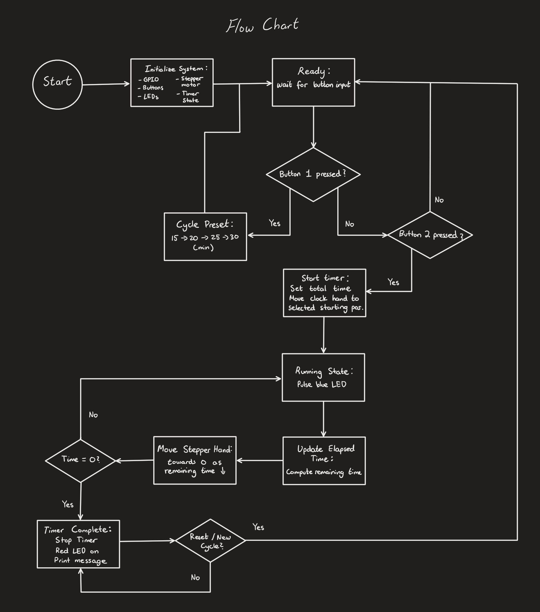

# Project Documentation

## Contents

| File | Description |
|------|-------------|
| `project_overview.md` | High-level goals and deliverables |
| `meeting_timer_flowchart.png` | Flowchart of meeting timer operation |

---
## System Flowchart

Shows the operating logic of the meeting timer, including preset selection, timer operation, stepper motor control, and timer completion.

## Quick Links

- [Firmware]()
- [Electrical]()
- [Enclosure]()
